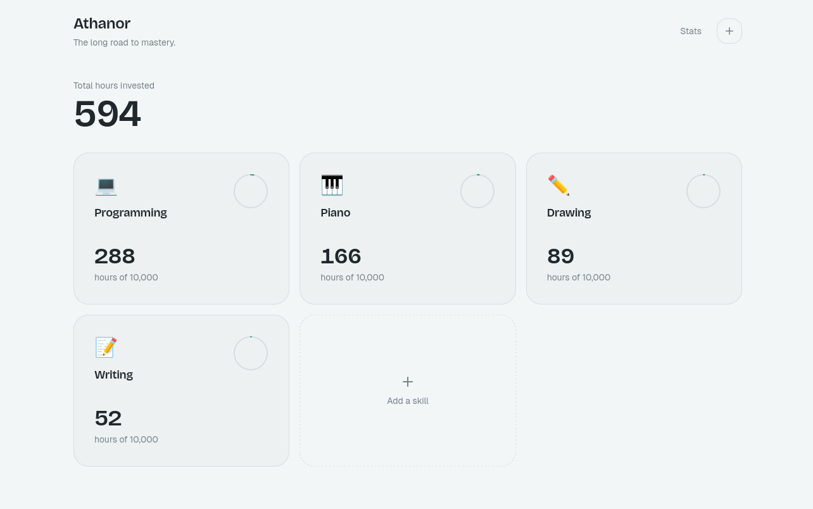
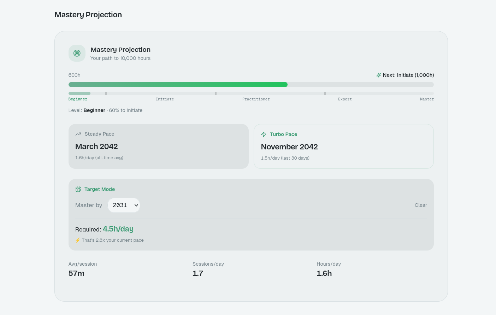
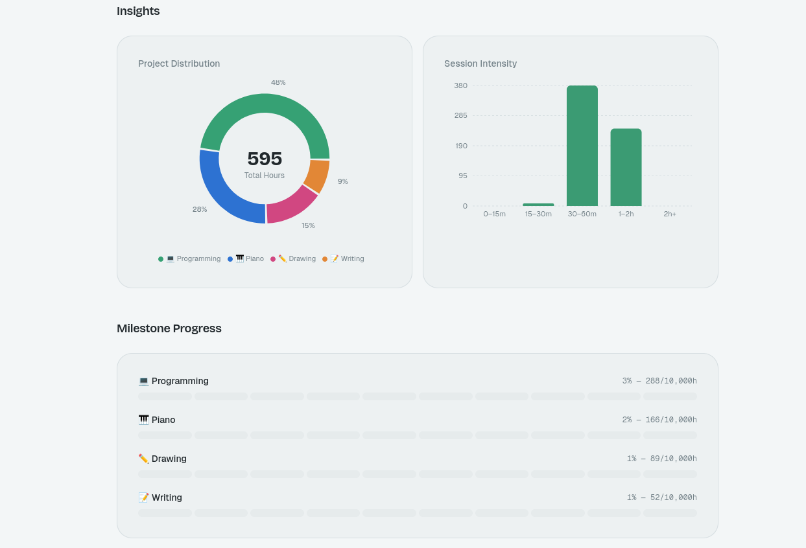

# 🏺 Athanor | Personal Mastery & Skill Analytics

**Athanor** is a sophisticated productivity and skill-tracking dashboard designed to visualize the journey toward the 10,000-hour milestone. Named after the "Alchemist's Furnace," the project focuses on the long-term refinement of skills through data-driven insights, habit consistency, and mastery projections.

Unlike traditional trackers, Athanor treats skill development as a multi-dimensional engineering problem, providing granular breakdowns of session intensity, project distribution, and velocity-based goal forecasting.

---

## 🚀 Key Features

### 1. Mastery Projection Engine
* **Dynamic Forecasting:** Calculates an estimated mastery date based on real-time velocity (average hours per day).
* **Tiered Achievement System:** Tracks progress through five developmental tiers: Beginner, Initiate (1,000h), Practitioner (2,000h), Expert (4,000h), and Master (10,000h).
* **Dual-Pace Modeling:** Compares your **Steady Pace** (all-time average) against your **Turbo Pace** (last 30 days) to visualize how recent intensity affects your long-term timeline.

### 2. High-Granularity Consistency Tracking
* **Adaptive Heatmaps:** Employs a GitHub-style contribution grid for annual views, which transitions into specialized bar charts for weekly and monthly analysis.
* **Session Intensity Analysis:** Visualizes the frequency of session lengths (e.g., 0-15m vs. 2h+ deep work bouts) to identify training patterns.
* **Peak Performance Insights:** Automatically identifies your most productive days of the week and average session durations per skill.

### 3. Multi-Project Distribution
* **Donut Analytics:** Provides a global percentage breakdown of time invested across all tracked disciplines (Programming, Piano, Drawing, Writing).
* **Milestone Progress Bars:** Segmented progress bars for each skill, displaying exact ratios toward the 10,000-hour goal.
* **Activity Log:** A detailed chronological record of practice sessions, including specific notes and session durations.

---

## 📸 Visual Overview

### Main Dashboard

*A high-level view of all active disciplines. Each "Monolith" card tracks total hours invested against the 10,000-hour mastery threshold, featuring real-time progress rings and category-specific iconography.*

### Predictive Analytics: 

*The projection engine calculates your estimated mastery date by comparing your Steady Pace (all-time average) against your Turbo Pace (30-day velocity). This view also tracks progress through developmental tiers, from Beginner to Master.*

### Advanced Insights & Distribution

*Detailed breakdown of project ownership via a Skill Distribution Donut and habit analysis through a Session Intensity Histogram. These metrics help identify peak performance patterns and ensure a balanced approach to the long road to mastery.*

---

## 🛠️ Technical Stack

* **Frontend:** React with **Vite** for optimized development and production builds.
* **Styling:** **Tailwind CSS** for a minimalist, "Monolith" aesthetic.
* **Visualization:** **Recharts** and **Framer Motion** for interactive data charts and smooth UI transitions.
* **Storage:** **Local-first architecture** using `localStorage` for maximum user privacy and zero-latency data access.
* **Icons:** **Lucide-React** for clean, scalable iconography.

---

## 🏗️ Getting Started

### Prerequisites
* **Node.js** (v18 or higher)
* **npm**, **bun**, or **pnpm**

### Installation
1. **Clone the repository:**
<<<<<<< HEAD
    git clone https://github.com/nikolozue93/Anathor.git

2. **Enter the project directory:**
   cd Anathor

3. **Install dependencies:**
   npm install

4. **Run the development server:**
   npm run dev

5. **Build for production:**
=======
   git clone https://github.com/nikolozue93/Anathor.git

2. **Enter the project directory:**
   cd Anathor

3. **Install dependencies:**
   npm install

4. **Run the development server:**
   npm run dev

5. **Build for production:**
>>>>>>> 0dab6921b6e7de0a2bf6ddc78fc36ecd2e2a30c0
   npm run build

## 📜 Future Roadmap

    Database Integration: Transitioning from localStorage to Supabase (PostgreSQL) for cross-device synchronization.

    Kanban Task Association: Linking specific practice sessions to project-specific tasks.

    Manual Backups: Feature to export habit data as a secure .json file.
<<<<<<< HEAD

Project by Nikoloz Beridze (nikolozue93) | The long road to mastery.
=======
    
## 🛠️ Build Process
Athanor was developed using an **AI-augmented rapid prototyping workflow**. This approach allowed for high-velocity iteration on complex data visualizations while ensuring the underlying logic—specifically the mastery projection formulas and local-first storage architecture—remained robust and developer-controlled.

Project by Nikoloz Beridze (nikolozue93) | The long road to mastery.
>>>>>>> 0dab6921b6e7de0a2bf6ddc78fc36ecd2e2a30c0
